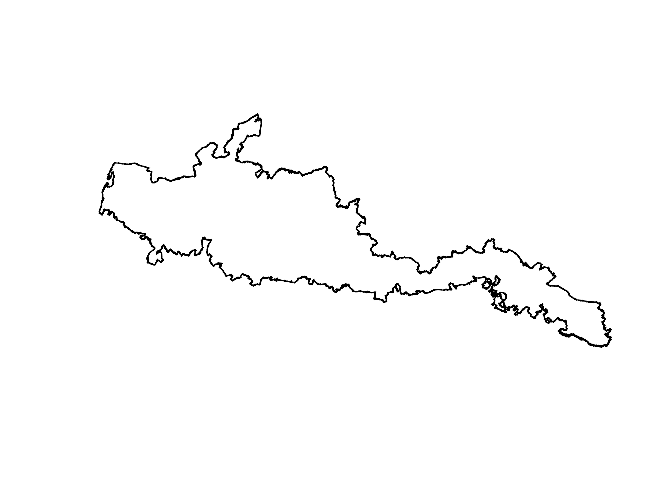
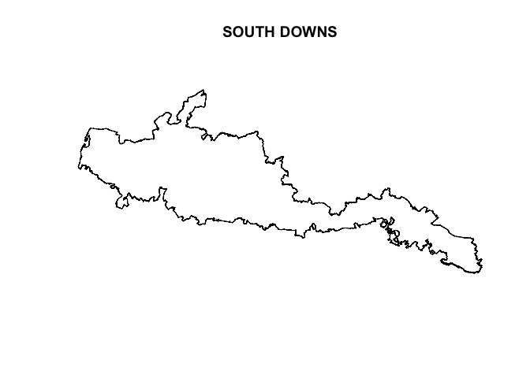
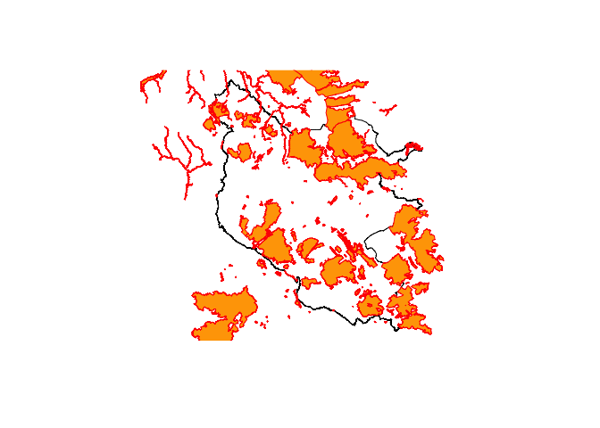

<!-- README.md is generated from README.Rmd. Please edit that file -->

# getarc

<!-- badges: start --> [](https://codecov.io/gh/MatthewJWhittle/getarc?branch=master)

<!-- badges: end -->

# Overview

`getarc` is an R wrapper for the [ArcGIS Rest
API](https://developers.arcgis.com/rest/services-reference/). It
currently only supports functionality for querying data on Feature and
Map Servers.

# Installation

The package can currently be installed from github:

``` r
# Install the development version from GitHub:
install.packages("devtools")
devtools::install_github("matthewjwhittle/getarc")
```

# Examples

``` r
library(getarc)
library(sf)
library(tidyverse)
```

Get arc provides two functions for querying data on an arcgis server:

  - `query_layer_fs` for querying data hosted on feature servers
  - `query_layer_ms` for querying data hosted on map servers

Both functions work in the same way. The key difference is that
resources on feature servers are defined using a `feature_server`
parameter and map servers accept a `folder` and `layer_name` argument.

# Getting data from a Feature Server - National Parks in England

``` r
# Basic operation
national_parks <- 
  query_layer_fs(
  host = "https://services.arcgis.com/",
  instance = "JJzESW51TqeY9uat",
  feature_server = "National_Parks_England",
  layer_id = 0
)
```

    ## Requesting data:
    ## https://services.arcgis.com//JJzESW51TqeY9uat/arcgis/rest/services/National_Parks_England/FeatureServer/0/query?returnIdsOnly=false&where=1=1&outFields=*&returnCountOnly=false&f=json&outSR=4326

    ## Reading layer `file63b9511ff613' from data source `/private/var/folders/v1/fwlnbmlx02gbqt40n73l823c0000gn/T/RtmpZabTow/file63b9511ff613.geojson' using driver `ESRIJSON'
    ## Simple feature collection with 10 features and 9 fields
    ## geometry type:  POLYGON
    ## dimension:      XY
    ## bbox:           xmin: -4.165798 ymin: 50.39201 xmax: 1.728154 ymax: 55.59151
    ## CRS:            4326

``` r
head(national_parks)
```

    ## Simple feature collection with 6 features and 9 fields
    ## geometry type:  POLYGON
    ## dimension:      XY
    ## bbox:           xmin: -4.165798 ymin: 50.39201 xmax: 0.2724446 ymax: 54.57154
    ## CRS:            4326
    ##   OBJECTID CODE             NAME MEASURE    DESIG_DATE
    ## 1        1   10      SOUTH DOWNS    1653 1257120000000
    ## 2        2    3           EXMOOR     693 -481334400000
    ## 3        3    9  YORKSHIRE DALES    2185 1470009600000
    ## 4        4    8    PEAK DISTRICT    1438 -591840000000
    ## 5        5    2         DARTMOOR     956  765158400000
    ## 6        6    7 NORTH YORK MOORS    1441 -541728000000
    ##                                  HOTLINK     STATUS Shape__Area Shape__Length
    ## 1              http://southdowns.gov.uk/ Designated  1652679314      602554.5
    ## 2 http://www.exmoor-nationalpark.gov.uk/ Designated   693121787      168905.7
    ## 3      http://www.yorkshiredales.org.uk/ Designated  2184826675      321727.5
    ## 4        http://www.peakdistrict.gov.uk/ Designated  1437831813      334994.8
    ## 5        http://www.dartmoor-npa.gov.uk/ Designated   955747461      164533.6
    ## 6      http://www.northyorkmoors.org.uk/ Designated  1441061643      304567.7
    ##                         geometry
    ## 1 POLYGON ((-0.7978181 50.865...
    ## 2 POLYGON ((-3.895272 51.1577...
    ## 3 POLYGON ((-2.271623 54.0653...
    ## 4 POLYGON ((-1.853568 53.2933...
    ## 5 POLYGON ((-3.879129 50.7296...
    ## 6 POLYGON ((-1.304131 54.3253...

``` r
# Plot the first 15 features
plot(national_parks$geometry[1])
```

<!-- -->

## Querys

A query can be included in the request by either supplying a named list
to the `query` parameter, or passing a bounding box to `bounding_box` to
return intersecting features.

The query parameter supports any query parameter supported by the API
Please review the [API
documentation](https://developers.arcgis.com/rest/services-reference/query-feature-service-layer-.htm)
on querying Feature Server layers for detail on how to query data. I
intend to provide more R-friendly support for query operations in the
future.

Returning only one feature.

``` r
one_park <- 
  query_layer_fs(
  host = "https://services.arcgis.com/",
  instance = "JJzESW51TqeY9uat",
  feature_server = "National_Parks_England",
  layer_id = 0, 
  # Return only one record
  query = c(resultRecordCount = 1)
)
```

    ## Requesting data:
    ## https://services.arcgis.com//JJzESW51TqeY9uat/arcgis/rest/services/National_Parks_England/FeatureServer/0/query?returnIdsOnly=false&where=1=1&outFields=*&returnCountOnly=false&f=json&outSR=4326&resultRecordCount=1

    ## Reading layer `file63b9b64bb70' from data source `/private/var/folders/v1/fwlnbmlx02gbqt40n73l823c0000gn/T/RtmpZabTow/file63b9b64bb70.geojson' using driver `ESRIJSON'
    ## Simple feature collection with 1 feature and 9 fields
    ## geometry type:  POLYGON
    ## dimension:      XY
    ## bbox:           xmin: -1.336625 ymin: 50.73341 xmax: 0.2724446 ymax: 51.19334
    ## CRS:            4326

``` r
print(one_park)
```

    ## Simple feature collection with 1 feature and 9 fields
    ## geometry type:  POLYGON
    ## dimension:      XY
    ## bbox:           xmin: -1.336625 ymin: 50.73341 xmax: 0.2724446 ymax: 51.19334
    ## CRS:            4326
    ##   OBJECTID CODE        NAME MEASURE    DESIG_DATE                   HOTLINK
    ## 1        1   10 SOUTH DOWNS    1653 1257120000000 http://southdowns.gov.uk/
    ##       STATUS Shape__Area Shape__Length                       geometry
    ## 1 Designated  1652679314      602554.5 POLYGON ((-0.7978181 50.865...

``` r
plot(one_park$geometry)
```

<!-- -->

``` r
# Including a sql where query to only return the yorkshire dales
yorkshire_dales <- 
  query_layer_fs(
  host = "https://services.arcgis.com/",
  instance = "JJzESW51TqeY9uat",
  feature_server = "National_Parks_England",
  layer_id = 0, 
  # SQL query to return data for the yorkshire dales 
  query = c("where" = "NAME='YORKSHIRE DALES'")
)
```

    ## Requesting data:
    ## https://services.arcgis.com//JJzESW51TqeY9uat/arcgis/rest/services/National_Parks_England/FeatureServer/0/query?returnIdsOnly=false&outFields=*&returnCountOnly=false&f=json&outSR=4326&where=NAME='YORKSHIRE%20DALES'

    ## Reading layer `file63b924dbbe8' from data source `/private/var/folders/v1/fwlnbmlx02gbqt40n73l823c0000gn/T/RtmpZabTow/file63b924dbbe8.geojson' using driver `ESRIJSON'
    ## Simple feature collection with 1 feature and 9 fields
    ## geometry type:  POLYGON
    ## dimension:      XY
    ## bbox:           xmin: -2.647804 ymin: 53.95412 xmax: -1.760838 ymax: 54.56901
    ## CRS:            4326

You can also pass the `query_layer_fs` function a bounding box and it
will perform a spatial query. This will return only features
intersecting with the bounding box. I intend to add support for more
advanced query operations in the future. If you need this functionality,
you could read the documentation and supply it to the `query` parameter.

``` r
dales_bbox <- st_bbox(yorkshire_dales)

# Which SSSI are in the yorkshire dales?
dales_sssi <- 
  query_layer_fs(
  host = "https://services.arcgis.com/",
  instance = "JJzESW51TqeY9uat",
  feature_server = "SSSI_England",
  layer_id = 0, 
  # Supply a bounding box for a spatial intersects query
  bounding_box = dales_bbox
)
```

    ## Requesting data:
    ## https://services.arcgis.com//JJzESW51TqeY9uat/arcgis/rest/services/SSSI_England/FeatureServer/0/query?returnIdsOnly=false&where=1=1&outFields=*&returnCountOnly=false&f=json&outSR=4326&geometry=-2.64780374735191,53.9541205345554,-1.76083788577198,54.5690087833252&geometryType=esriGeometryEnvelope&spatialRel=esriSpatialRelIntersects&inSR=4326

    ## Reading layer `file63b95bfe07ea' from data source `/private/var/folders/v1/fwlnbmlx02gbqt40n73l823c0000gn/T/RtmpZabTow/file63b95bfe07ea.geojson' using driver `ESRIJSON'
    ## Simple feature collection with 287 features and 19 fields
    ## geometry type:  POLYGON
    ## dimension:      XY
    ## bbox:           xmin: -3.049523 ymin: 53.89466 xmax: -1.672062 ymax: 55.04233
    ## CRS:            4326

``` r
yorkshire_dales <- yorkshire_dales %>% st_transform(crs = 27700)
dales_sssi <- dales_sssi %>% st_transform(crs = 27700)
plot(yorkshire_dales$geometry)
plot(dales_sssi$geometry, add = TRUE, border = "red", col = "orange")
```

<!-- -->

# Parse Query URLs

`getarc` provides `parse_query_url` which parses the parameters from a
query url (such as those you can find on api explorer apps). The
function will return another function with all the api endpoints already
specified.

``` r
url <- "https://services.arcgis.com/JJzESW51TqeY9uat/arcgis/rest/services/Local_Nature_Reserves_England/FeatureServer/0/query?where=1%3D1&outFields=*&outSR=4326&f=json"

get_local_nature_reserves <- 
  parse_query_url(url)

one_lnr <- 
  get_local_nature_reserves(
  # Return only one record to speed up processing for example
  query = c(resultRecordCount = 1))
```

    ## Requesting data:
    ## https://services.arcgis.com/JJzESW51TqeY9uat/arcgis/rest/services/Local_Nature_Reserves_England/FeatureServer/0/query?returnIdsOnly=false&where=1=1&outFields=*&returnCountOnly=false&f=json&outSR=4326&resultRecordCount=1

    ## Reading layer `file63b971a62f58' from data source `/private/var/folders/v1/fwlnbmlx02gbqt40n73l823c0000gn/T/RtmpZabTow/file63b971a62f58.geojson' using driver `ESRIJSON'
    ## Simple feature collection with 1 feature and 19 fields
    ## geometry type:  POLYGON
    ## dimension:      XY
    ## bbox:           xmin: -2.184972 ymin: 53.86497 xmax: -2.179005 ymax: 53.86747
    ## CRS:            4326

``` r
print(one_lnr)
```

    ## Simple feature collection with 1 feature and 19 fields
    ## geometry type:  POLYGON
    ## dimension:      XY
    ## bbox:           xmin: -2.184972 ymin: 53.86497 xmax: -2.179005 ymax: 53.86747
    ## CRS:            4326
    ##   OBJECTID            LNR_NAME LNR_AREA  EASTING NORTHING  LATITUDE LONGITUDE
    ## 1        1 Alkincoats Woodland 8.120372 388121.4 441137.3 53:52:01N  2:11:04W
    ##   REFERENCE   STATUS     GID GIS_FILE NUMBER     AREA EASTING0 NORTHING0
    ## 1  SD881411 Declared 1421535                 8.120372 388121.4  441137.3
    ##   GIS_DATE VERSION Shape__Area Shape__Length                       geometry
    ## 1 20120328       1    81203.72       1260.17 POLYGON ((-2.180326 53.8649...

# Authentication

Authentication is done via oauth2.0 and the `get_token` function. Sign
in is done via a popup browser window and the token can be passed to the
query functions via the `my_token` argument.

``` r
my_token <- get_token()

data <-
  query_layer_fs(
  host = "https://services.arcgis.com/",
  instance = "JJzESW51TqeY9uat",
  feature_server = "Private_Service",
  layer_id = 0, 
  # Pass in token for a private service
  my_token = my_token
)
```
