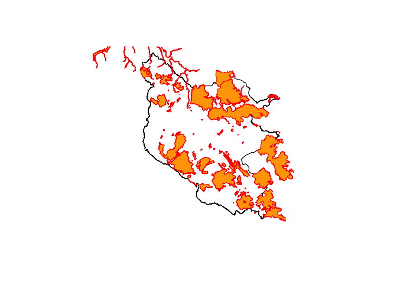

<!-- README.md is generated from README.Rmd. Please edit that file -->

# getarc

<!-- badges: start --> [](https://codecov.io/gh/MatthewJWhittle/getarc?branch=master)

<!-- badges: end -->

# Overview

`getarc` is an R wrapper for the [ArcGIS Rest
API](https://developers.arcgis.com/rest/services-reference/). It
provides access to the extensive open data available from [Arc
GIS](https://hub.arcgis.com/search). It currently only supports
functionality for querying data.

  - `query_layer` gets data from an arc gis server and supports query
    operations
  - `get_layer_details` gets metadata about a layer such as the field
    names and maxRecordCount
  - `get_token` gets an access token via a web browser login to access
    private services

# Installation

The package can currently be installed from github:

``` r
# Install the development version from GitHub:
install.packages("devtools")
devtools::install_github("matthewjwhittle/getarc")
```

# Examples

``` r
library(getarc)
library(sf)
library(tidyverse)
```

# Getting data

Data on an arc gis server can be accessed via the `query_layer`
function. This function also supports any query operation supported by
the ArcGIS Rest API.

# Getting data from a Feature Server - National Parks in England

``` r
# Define the endpoint URL
parks_endpoint <- "https://services.arcgis.com//JJzESW51TqeY9uat/arcgis/rest/services/National_Parks_England/FeatureServer/0"
# Get the data
national_parks <- 
  query_layer(endpoint = parks_endpoint)
```

    ## Requesting data:
    ## https://services.arcgis.com//JJzESW51TqeY9uat/arcgis/rest/services/National_Parks_England/FeatureServer/0/query?returnIdsOnly=false&where=1=1&outFields=*&returnCountOnly=false&f=json&outSR=4326

    ## Reading layer `file22aa5a62693c' from data source `/private/var/folders/v1/fwlnbmlx02gbqt40n73l823c0000gn/T/RtmpGWqPqZ/file22aa5a62693c.geojson' using driver `ESRIJSON'
    ## Simple feature collection with 10 features and 9 fields
    ## geometry type:  POLYGON
    ## dimension:      XY
    ## bbox:           xmin: -4.165798 ymin: 50.39201 xmax: 1.728154 ymax: 55.59151
    ## CRS:            4326

``` r
head(national_parks)
```

    ## Simple feature collection with 6 features and 9 fields
    ## geometry type:  POLYGON
    ## dimension:      XY
    ## bbox:           xmin: -4.165798 ymin: 50.39201 xmax: 0.2724446 ymax: 54.57154
    ## CRS:            4326
    ##   OBJECTID CODE             NAME MEASURE    DESIG_DATE
    ## 1        1   10      SOUTH DOWNS    1653 1257120000000
    ## 2        2    3           EXMOOR     693 -481334400000
    ## 3        3    9  YORKSHIRE DALES    2185 1470009600000
    ## 4        4    8    PEAK DISTRICT    1438 -591840000000
    ## 5        5    2         DARTMOOR     956  765158400000
    ## 6        6    7 NORTH YORK MOORS    1441 -541728000000
    ##                                  HOTLINK     STATUS Shape__Area Shape__Length
    ## 1              http://southdowns.gov.uk/ Designated  1652679314      602554.5
    ## 2 http://www.exmoor-nationalpark.gov.uk/ Designated   693121787      168905.7
    ## 3      http://www.yorkshiredales.org.uk/ Designated  2184826675      321727.5
    ## 4        http://www.peakdistrict.gov.uk/ Designated  1437831813      334994.8
    ## 5        http://www.dartmoor-npa.gov.uk/ Designated   955747461      164533.6
    ## 6      http://www.northyorkmoors.org.uk/ Designated  1441061643      304567.7
    ##                         geometry
    ## 1 POLYGON ((-0.7978181 50.865...
    ## 2 POLYGON ((-3.895272 51.1577...
    ## 3 POLYGON ((-2.271623 54.0653...
    ## 4 POLYGON ((-1.853568 53.2933...
    ## 5 POLYGON ((-3.879129 50.7296...
    ## 6 POLYGON ((-1.304131 54.3253...

``` r
# Plot the first feature
plot(national_parks$geometry[1])
```

<!-- -->

## Querys

A query can be included in the request by either supplying a named list
to the `query` parameter, or passing a bounding box to `bounding_box` to
return intersecting features.

The query parameter supports any query parameter supported by the API
Please review the [API
documentation](https://developers.arcgis.com/rest/services-reference/query-feature-service-layer-.htm)
on querying Feature Server layers for detail on how to query data. I
intend to provide more R-friendly support for query operations in the
future.

Returning only one feature.

``` r
one_park <- 
  query_layer(endpoint = parks_endpoint,
  # Return only one record
  query = c(resultRecordCount = 1)
)
```

    ## Requesting data:
    ## https://services.arcgis.com//JJzESW51TqeY9uat/arcgis/rest/services/National_Parks_England/FeatureServer/0/query?returnIdsOnly=false&where=1=1&outFields=*&returnCountOnly=false&f=json&outSR=4326&resultRecordCount=1

    ## Reading layer `file22aa26883cca' from data source `/private/var/folders/v1/fwlnbmlx02gbqt40n73l823c0000gn/T/RtmpGWqPqZ/file22aa26883cca.geojson' using driver `ESRIJSON'
    ## Simple feature collection with 1 feature and 9 fields
    ## geometry type:  POLYGON
    ## dimension:      XY
    ## bbox:           xmin: -1.336625 ymin: 50.73341 xmax: 0.2724446 ymax: 51.19334
    ## CRS:            4326

``` r
print(one_park)
```

    ## Simple feature collection with 1 feature and 9 fields
    ## geometry type:  POLYGON
    ## dimension:      XY
    ## bbox:           xmin: -1.336625 ymin: 50.73341 xmax: 0.2724446 ymax: 51.19334
    ## CRS:            4326
    ##   OBJECTID CODE        NAME MEASURE    DESIG_DATE                   HOTLINK
    ## 1        1   10 SOUTH DOWNS    1653 1257120000000 http://southdowns.gov.uk/
    ##       STATUS Shape__Area Shape__Length                       geometry
    ## 1 Designated  1652679314      602554.5 POLYGON ((-0.7978181 50.865...

``` r
plot(one_park$geometry)
```

<!-- -->

``` r
# Including a sql where query to only return the yorkshire dales
yorkshire_dales <- 
  query_layer(endpoint = parks_endpoint,
  # SQL query to return data for the yorkshire dales 
  query = c("where" = "NAME='YORKSHIRE DALES'")
)
```

    ## Requesting data:
    ## https://services.arcgis.com//JJzESW51TqeY9uat/arcgis/rest/services/National_Parks_England/FeatureServer/0/query?returnIdsOnly=false&outFields=*&returnCountOnly=false&f=json&outSR=4326&where=NAME='YORKSHIRE%20DALES'

    ## Reading layer `file22aa3a4f0589' from data source `/private/var/folders/v1/fwlnbmlx02gbqt40n73l823c0000gn/T/RtmpGWqPqZ/file22aa3a4f0589.geojson' using driver `ESRIJSON'
    ## Simple feature collection with 1 feature and 9 fields
    ## geometry type:  POLYGON
    ## dimension:      XY
    ## bbox:           xmin: -2.647804 ymin: 53.95412 xmax: -1.760838 ymax: 54.56901
    ## CRS:            4326

Spatial querys can be perform either via the `query` argument or by
passing a bounding box to the `bounding_box` argument. This will perform
a spatial query and return only features intersecting with the bounding
box. I intend to add support for more advanced query operations in the
future.

``` r
dales_bbox <- st_bbox(yorkshire_dales)

# Which Sites of Special Scientific Interest are in the yorkshire dales?
sssi_endpoint <- "https://services.arcgis.com//JJzESW51TqeY9uat/arcgis/rest/services/SSSI_England/FeatureServer/0"
dales_sssi <- 
  query_layer(sssi_endpoint, 
  # Supply a bounding box for a spatial intersects query
  bounding_box = dales_bbox
)
```

    ## Requesting data:
    ## https://services.arcgis.com//JJzESW51TqeY9uat/arcgis/rest/services/SSSI_England/FeatureServer/0/query?returnIdsOnly=false&where=1=1&outFields=*&returnCountOnly=false&f=json&outSR=4326&geometry=-2.64780374735191,53.9541205345554,-1.76083788577198,54.5690087833252&geometryType=esriGeometryEnvelope&spatialRel=esriSpatialRelIntersects&inSR=4326

    ## Reading layer `file22aa3d6b7a1' from data source `/private/var/folders/v1/fwlnbmlx02gbqt40n73l823c0000gn/T/RtmpGWqPqZ/file22aa3d6b7a1.geojson' using driver `ESRIJSON'
    ## Simple feature collection with 287 features and 19 fields
    ## geometry type:  POLYGON
    ## dimension:      XY
    ## bbox:           xmin: -3.049523 ymin: 53.89466 xmax: -1.672062 ymax: 55.04233
    ## CRS:            4326

``` r
# Transform the data for plotting
yorkshire_dales <- yorkshire_dales %>% st_transform(crs = 27700)
dales_sssi <- dales_sssi %>% st_transform(crs = 27700)

# Plot the yorkshire dales and it's SSSIs
plot(yorkshire_dales$geometry)
plot(dales_sssi$geometry, add = TRUE, border = "red", col = "orange")
```

<!-- -->

# Endpoints

The endpoint url can be copied from Query URL box of th Arc GIS API
explorer, or created using the `feature_server_endpoint` or
`map_server_endpoint` functions.

Both `feature_server_endpoint` and `map_server_endpoint` work in the
same way. The key difference is that resources on feature servers are
defined using a `feature_server` parameter and map servers accept a
`folder` and `layer_name` argument.

``` r
national_parks_endpoint <- 
  feature_server_endpoint(
  host = "https://services.arcgis.com/",
  instance = "JJzESW51TqeY9uat",
  feature_server = "National_Parks_England",
  layer_id = 0
)
postcodes_endpoint <- 
  map_server_endpoint(
  host = "https://ons-inspire.esriuk.com",
  instance = "arcgis",
  folder = "Postcodes",
  service_name = "ONS_Postcode_Directory_Latest_Centroids",
  layer_id = 0
)

query_layer(postcodes_endpoint, 
            query = c(maxRecordCount = 1))
```

    ## Requesting data:
    ## https://ons-inspire.esriuk.com/arcgis/rest/services/Postcodes/ONS_Postcode_Directory_Latest_Centroids/MapServer/0//query?returnIdsOnly=false&where=1=1&outFields=*&returnCountOnly=false&f=json&outSR=4326&maxRecordCount=1

    ## Reading layer `file22aa53d49c44' from data source `/private/var/folders/v1/fwlnbmlx02gbqt40n73l823c0000gn/T/RtmpGWqPqZ/file22aa53d49c44.geojson' using driver `ESRIJSON'
    ## Simple feature collection with 1000 features and 51 fields
    ## geometry type:  POINT
    ## dimension:      XY
    ## bbox:           xmin: -2.489735 ymin: 57.05139 xmax: -2.069235 ymax: 57.66384
    ## CRS:            4326

    ## Warning in query_layer(postcodes_endpoint, query = c(maxRecordCount = 1)): May
    ## have reached limit of maximum features to return, try performing query to narrow
    ## down results.

    ## Simple feature collection with 1000 features and 51 fields
    ## geometry type:  POINT
    ## dimension:      XY
    ## bbox:           xmin: -2.489735 ymin: 57.05139 xmax: -2.069235 ymax: 57.66384
    ## CRS:            4326
    ## First 10 features:
    ##    objectid     pcd     pcd2    pcds dointr doterm     oscty       ced
    ## 1         1 AB1 0AA AB1  0AA AB1 0AA 198001 199606 S99999999 S99999999
    ## 2         2 AB1 0AB AB1  0AB AB1 0AB 198001 199606 S99999999 S99999999
    ## 3         3 AB1 0AD AB1  0AD AB1 0AD 198001 199606 S99999999 S99999999
    ## 4         4 AB1 0AE AB1  0AE AB1 0AE 199402 199606 S99999999 S99999999
    ## 5         5 AB1 0AF AB1  0AF AB1 0AF 199012 199207 S99999999 S99999999
    ## 6         6 AB1 0AG AB1  0AG AB1 0AG 199012 199207 S99999999 S99999999
    ## 7         7 AB1 0AJ AB1  0AJ AB1 0AJ 198001 199606 S99999999 S99999999
    ## 8         8 AB1 0AL AB1  0AL AB1 0AL 198001 199606 S99999999 S99999999
    ## 9         9 AB1 0AN AB1  0AN AB1 0AN 198001 199606 S99999999 S99999999
    ## 10       10 AB1 0AP AB1  0AP AB1 0AP 198001 199606 S99999999 S99999999
    ##       oslaua    osward usertype oseast1m osnrth1m osgrdind  oshlthau     nhser
    ## 1  S12000033 S13002843        0   385386  0801193        1 S08000020 S99999999
    ## 2  S12000033 S13002843        0   385177  0801314        1 S08000020 S99999999
    ## 3  S12000033 S13002843        0   385053  0801092        1 S08000020 S99999999
    ## 4  S12000034 S13002864        0   384600  0799300        8 S08000020 S99999999
    ## 5  S12000033 S13002843        1   384460  0800660        8 S08000020 S99999999
    ## 6  S12000033 S13002843        1   383890  0800710        8 S08000020 S99999999
    ## 7  S12000033 S13002843        0   384779  0800921        1 S08000020 S99999999
    ## 8  S12000033 S13002843        0   384669  0801228        1 S08000020 S99999999
    ## 9  S12000033 S13002843        1   385225  0800757        1 S08000020 S99999999
    ## 10 S12000033 S13002843        0   385208  0800834        1 S08000020 S99999999
    ##         ctry       rgn streg      pcon       eer    teclec      ttwa       pct
    ## 1  S92000003 S99999999     0 S14000002 S15000001 S09000001 S22000047 S03000012
    ## 2  S92000003 S99999999     0 S14000002 S15000001 S09000001 S22000047 S03000012
    ## 3  S92000003 S99999999     0 S14000002 S15000001 S09000001 S22000047 S03000012
    ## 4  S92000003 S99999999     0 S14000058 S15000001 S09000001 S22000047 S03000013
    ## 5  S92000003 S99999999     0 S14000002 S15000001 S09000001 S22000047 S03000012
    ## 6  S92000003 S99999999     0 S14000002 S15000001 S09000001 S22000047 S03000012
    ## 7  S92000003 S99999999     0 S14000002 S15000001 S09000001 S22000047 S03000012
    ## 8  S92000003 S99999999     0 S14000002 S15000001 S09000001 S22000047 S03000012
    ## 9  S92000003 S99999999     0 S14000002 S15000001 S09000001 S22000047 S03000012
    ## 10 S92000003 S99999999     0 S14000002 S15000001 S09000001 S22000047 S03000012
    ##         nuts statsward      oa01 casward      park    lsoa01    msoa01 ur01ind
    ## 1  S31000935    99ZZ00 S00001364   01C30 S99999999 S01000011 S02000007       6
    ## 2  S31000935    99ZZ00 S00001270   01C31 S99999999 S01000011 S02000007       6
    ## 3  S31000935    99ZZ00 S00001364   01C30 S99999999 S01000011 S02000007       6
    ## 4  S31001005    99ZZ00 S00002142   02C58 S99999999 S01000333 S02000061       6
    ## 5  S31000934    99ZZ00 S00001266   01C30 S99999999 S01000007 S02000003       3
    ## 6  S31000934    99ZZ00 S00001258   01C30 S99999999 S01000001 S02000003       3
    ## 7  S31000934    99ZZ00 S00001364   01C30 S99999999 S01000011 S02000007       6
    ## 8  S31000935    99ZZ00 S00001364   01C30 S99999999 S01000011 S02000007       6
    ## 9  S31000935    99ZZ00 S00001364   01C30 S99999999 S01000011 S02000007       6
    ## 10 S31000935    99ZZ00 S00001364   01C30 S99999999 S01000011 S02000007       6
    ##    oac01      oa11    lsoa11    msoa11    parish      wz11       ccg     bua11
    ## 1    3C2 S00090303 S01006514 S02001237 S99999999 S34002990 S03000012 S99999999
    ## 2    4B3 S00090303 S01006514 S02001237 S99999999 S34002990 S03000012 S99999999
    ## 3    3C2 S00090399 S01006514 S02001237 S99999999 S34003015 S03000012 S99999999
    ## 4    3B1 S00091322 S01006853 S02001296 S99999999 S34003292 S03000013 S99999999
    ## 5    4D2 S00090299 S01006511 S02001236 S99999999 S34003015 S03000012 S99999999
    ## 6    5B4 S00090291 S01006506 S02001236 S99999999 S34003124 S03000012 S99999999
    ## 7    3C2 S00090399 S01006514 S02001237 S99999999 S34003015 S03000012 S99999999
    ## 8    3C2 S00090381 S01006511 S02001236 S99999999 S34002990 S03000012 S99999999
    ## 9    3C2 S00090399 S01006514 S02001237 S99999999 S34003015 S03000012 S99999999
    ## 10   3C2 S00090399 S01006514 S02001237 S99999999 S34003015 S03000012 S99999999
    ##      buasd11 ru11ind oac11      lat      long      lep1      lep2       pfa
    ## 1  S99999999       3   1C3 57.10147 -2.242851 S99999999 S99999999 S23000009
    ## 2  S99999999       3   1C3 57.10255 -2.246308 S99999999 S99999999 S23000009
    ## 3  S99999999       3   6A1 57.10056 -2.248342 S99999999 S99999999 S23000009
    ## 4  S99999999       6   1A2 57.08444 -2.255708 S99999999 S99999999 S23000009
    ## 5  S99999999       3   6A4 57.09666 -2.258102 S99999999 S99999999 S23000009
    ## 6  S99999999       3   7C3 57.09708 -2.267513 S99999999 S99999999 S23000009
    ## 7  S99999999       3   6A1 57.09901 -2.252854 S99999999 S99999999 S23000009
    ## 8  S99999999       3   6B3 57.10177 -2.254688 S99999999 S99999999 S23000009
    ## 9  S99999999       3   6A1 57.09755 -2.245483 S99999999 S99999999 S23000009
    ## 10 S99999999       3   6A1 57.09824 -2.245768 S99999999 S99999999 S23000009
    ##     imd    calncv       stp                   geometry
    ## 1  6808 S99999999 S99999999 POINT (-2.242858 57.10146)
    ## 2  6808 S99999999 S99999999 POINT (-2.246315 57.10254)
    ## 3  6808 S99999999 S99999999 POINT (-2.248348 57.10054)
    ## 4  5503 S99999999 S99999999 POINT (-2.255714 57.08443)
    ## 5  6668 S99999999 S99999999 POINT (-2.258109 57.09664)
    ## 6  5272 S99999999 S99999999 POINT (-2.267519 57.09707)
    ## 7  6808 S99999999 S99999999    POINT (-2.25286 57.099)
    ## 8  6668 S99999999 S99999999 POINT (-2.254695 57.10175)
    ## 9  6808 S99999999 S99999999  POINT (-2.24549 57.09754)
    ## 10 6808 S99999999 S99999999 POINT (-2.245775 57.09823)

# Authentication

Authentication is done via oauth2.0 and the `get_token` function. Sign
in is done via a popup browser window and the token can be passed to the
query functions via the `my_token` argument.

``` r
my_token <- get_token()

data <-
  query_layer(endpoint = private_endpoint,
  # Pass in token for a private service
  my_token = my_token
)
```
