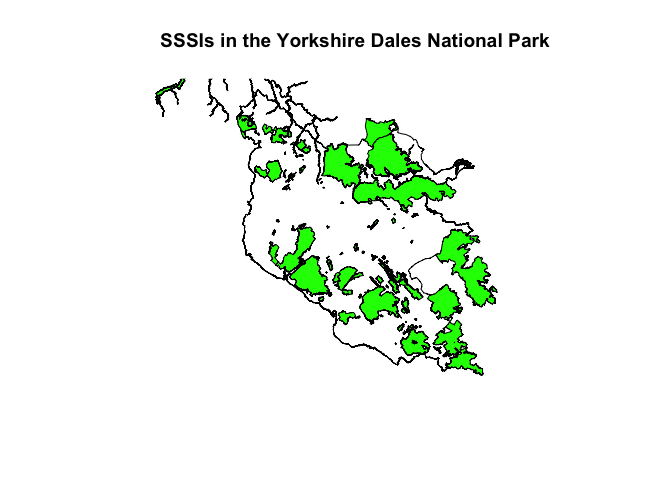

<!-- README.md is generated from README.Rmd. Please edit that file -->

# getarc

<!-- badges: start -->

[](https://codecov.io/gh/MatthewJWhittle/getarc?branch=master)

<!-- badges: end -->

# Overview

`getarc` is an R wrapper for the [ArcGIS Rest
API](https://developers.arcgis.com/rest/services-reference/). It
provides access to any data hosted on an ArcGIS Feature or Map Server,
including exstensive open datasets ([Arc
GIS](https://hub.arcgis.com/search)). It currently only supports
functionality for querying data.

-   `query_layer` gets data from an arc gis server and supports query
    operations
-   `get_layer_details` gets metadata about a layer such as the field
    names and maxRecordCount
-   `get_token` gets an access token via a web browser login to access
    private services

# Installation

The package can currently be installed from github:

``` r
# Install the development version from GitHub:
install.packages("devtools")
devtools::install_github("matthewjwhittle/getarc")
```

``` r
library(getarc)
library(sf)
library(tidyverse)
```

# Getting Started

## Downloading Data

The `query_layer` function is used to query and download a layer from an
Arc GIS server. The layer is identified by the endpoint url. This can be
found by visting the service reference, clicking the API explorer tab
and copying the query url (up to “/query?…”).


A few endpoint urls are provided with the package for testing in the
getarc::endpoints object.

``` r
national_parks <- query_layer(endpoint = endpoints$national_parks_england)
glimpse(national_parks)
```

    ## Rows: 10
    ## Columns: 10
    ## $ OBJECTID      <int> 1, 2, 3, 4, 5, 6, 7, 8, 9, 10
    ## $ CODE          <int> 10, 3, 9, 8, 2, 7, 5, 6, 4, 1
    ## $ NAME          <chr> "SOUTH DOWNS", "EXMOOR", "YORKSHIRE DALES", "PEAK DISTR…
    ## $ MEASURE       <dbl> 1653, 693, 2185, 1438, 956, 1441, 567, 1051, 2362, 302
    ## $ DESIG_DATE    <dttm> 2009-11-02 00:00:00, 1954-10-01 01:00:00, 2016-08-01 0…
    ## $ HOTLINK       <chr> "http://southdowns.gov.uk/", "http://www.exmoor-nationa…
    ## $ STATUS        <chr> "Designated", "Designated", "Designated", "Designated",…
    ## $ Shape__Area   <dbl> 1652679314, 693121787, 2184826675, 1437831813, 95574746…
    ## $ Shape__Length <dbl> 602554.5, 168905.7, 321727.5, 334994.8, 164533.6, 30456…
    ## $ geometry      <POLYGON [°]> POLYGON ((-0.7978181 50.865..., POLYGON ((-3.89…

Spatial data is returned as an sf object. It is also possible to query
tables on an ArcGIS server or return data without a geometry and this
will return a tibble.

``` r
# Plot the first geometry in the object and add the national park's name as the title
plot(national_parks$geometry[1], main = national_parks$NAME[1])
```

<!-- -->

## Performing Queries

The ArcGIS Rest API supports a number of query operations to return only
the features you need. All query operations are supported via
`query_layer` either as a named argument or via the query argument which
accepts a named vector of query parameters and arguments. You can also
request a maximum number of features, only certain columns, no geometry
or less precise geometry. These options all reduce the amount of data
transferred and therefore improve the download speed.

``` r
one_park <- 
  query_layer(endpoint = endpoints$national_parks_england,
  return_n = 1
)
glimpse(one_park)
```

    ## Rows: 1
    ## Columns: 10
    ## $ OBJECTID      <int> 5
    ## $ CODE          <int> 2
    ## $ NAME          <chr> "DARTMOOR"
    ## $ MEASURE       <dbl> 956
    ## $ DESIG_DATE    <dttm> 1994-04-01 01:00:00
    ## $ HOTLINK       <chr> "http://www.dartmoor-npa.gov.uk/"
    ## $ STATUS        <chr> "Designated"
    ## $ Shape__Area   <dbl> 955747461
    ## $ Shape__Length <dbl> 164533.6
    ## $ geometry      <POLYGON [°]> POLYGON ((-3.879129 50.7296...

SQL where queries are supported vie the `where` argument. Here I am
requesting only the Yorkshire Dales National Park.

``` r
yorkshire_dales <-
  query_layer(endpoint = endpoints$national_parks_england,
              where = "NAME LIKE 'YORKSHIRE DALES'")

plot(yorkshire_dales$geometry, main = yorkshire_dales$NAME)
```

<!-- -->

You can also pass in a geometry to perform a spatial query (defaulting
to intersects).

``` r
dales_sssi <- query_layer(endpoints$sssi_england, in_geometry = yorkshire_dales$geometry)
# Plot:
plot(yorkshire_dales$geometry, main = "SSSIs in the Yorkshire Dales National Park")
plot(dales_sssi$geometry, col = "green", add = TRUE)
```

<!-- -->

The Making Queries vignette (in development) provides much more detail
on how to perform queries with `query_layer`. You can also read the [API
documentation](https://developers.arcgis.com/rest/services-reference/query-feature-service-layer-.htm)
for further detail on performing queries.

# Authentication

The package supports authentication for private servers. This is either
done via `get_token` OAuth 2.0 in a popup web browser or via the
`generate_token` where OAuth 2.0 isn’t supported. Tokens generated by
either function should be passed to the `my_token` argument of
`query_layer` to authenticate requests.

To use authentication (with `get_token` only) you need to [set up an
ArcGIS developers account](https://developers.arcgis.com/sign-up/) (for
free) and create an app. This takes about 5 minutes. Once complete you
need to navigate to the app on your dashboard, copy the credentials and
set them using `set_credentials`. These are saved securely using the
keyring package and now you can use `get_token` to access secured
services where you have access.

``` r
# Set Credentials (once)
set_credentials(client_id = "xxxx", client_secret = "xxxx", app_name = "My App")
my_token <- get_token()

## Or:
my_token <- get_token(client_id = "xxxx", client_secret = "xxxx", app_name = "My App")

data <-
  query_layer(endpoint = private_endpoint,
  # Pass in token for a secured service
  my_token = my_token
)
```

# Future Development

Things I am working on supporting at the moment:

-   Adding new features to a feature layer via addFeatures

-   Appending data to a feature layer via append

Things I would like to do in the future:

-   Caching the results of `query_layer`

-   Only requesting data that has changed from the cache
