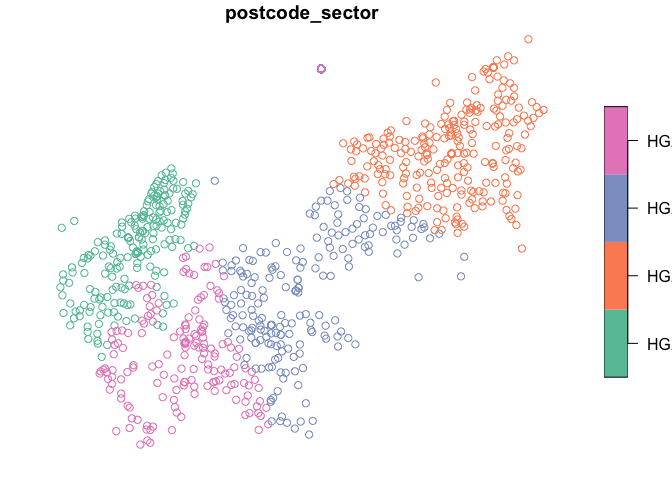

<!-- README.md is generated from README.Rmd. Please edit that file -->

# getarc

<!-- badges: start --> [](https://codecov.io/gh/MatthewJWhittle/getarc?branch=master)

<!-- badges: end -->

# Overview

`getarc` is an R wrapper for the [ArcGIS Rest
API](https://developers.arcgis.com/rest/services-reference/). It
provides access to the extensive open data available from [Arc
GIS](https://hub.arcgis.com/search). It currently only supports
functionality for querying data.

  - `query_layer` gets data from an arc gis server and supports query
    operations
  - `get_layer_details` gets metadata about a layer such as the field
    names and maxRecordCount
  - `get_token` gets an access token via a web browser login to access
    private services

# Installation

The package can currently be installed from github:

``` r
# Install the development version from GitHub:
install.packages("devtools")
devtools::install_github("matthewjwhittle/getarc")
```

# Examples

``` r
library(getarc)
library(sf)
library(tidyverse)
```

# Getting data

Data on an arc gis server can be accessed via the `query_layer`
function. This function also supports any query operation supported by
the ArcGIS Rest API.

# Getting data from a Feature Server - National Parks in England

``` r
# Use the endpoints list 

# Get the data
national_parks <- 
  query_layer(endpoint = endpoints$national_parks_england)
```

    ## Requesting data:
    ## https://services.arcgis.com//JJzESW51TqeY9uat/arcgis/rest/services/National_Parks_England/FeatureServer/0/query?returnIdsOnly=false&where=1=1&outFields=*&returnCountOnly=false&f=json&outSR=4326&returnGeometry=true

    ## Reading layer `file36743c28e3fe' from data source `/private/var/folders/v1/fwlnbmlx02gbqt40n73l823c0000gn/T/Rtmplh7Kjq/file36743c28e3fe.geojson' using driver `ESRIJSON'
    ## Simple feature collection with 10 features and 9 fields
    ## geometry type:  POLYGON
    ## dimension:      XY
    ## bbox:           xmin: -4.165798 ymin: 50.39201 xmax: 1.728154 ymax: 55.59151
    ## CRS:            4326

``` r
head(national_parks)
```

    ## Simple feature collection with 6 features and 9 fields
    ## geometry type:  POLYGON
    ## dimension:      XY
    ## bbox:           xmin: -4.165798 ymin: 50.39201 xmax: 0.2724446 ymax: 54.57154
    ## CRS:            4326
    ##   OBJECTID CODE             NAME MEASURE          DESIG_DATE
    ## 1        1   10      SOUTH DOWNS    1653 2009-11-02 00:00:00
    ## 2        2    3           EXMOOR     693 1954-10-01 01:00:00
    ## 3        3    9  YORKSHIRE DALES    2185 2016-08-01 01:00:00
    ## 4        4    8    PEAK DISTRICT    1438 1951-04-01 00:00:00
    ## 5        5    2         DARTMOOR     956 1994-04-01 01:00:00
    ## 6        6    7 NORTH YORK MOORS    1441 1952-11-01 00:00:00
    ##                                  HOTLINK     STATUS Shape__Area Shape__Length
    ## 1              http://southdowns.gov.uk/ Designated  1652679314      602554.5
    ## 2 http://www.exmoor-nationalpark.gov.uk/ Designated   693121787      168905.7
    ## 3      http://www.yorkshiredales.org.uk/ Designated  2184826675      321727.5
    ## 4        http://www.peakdistrict.gov.uk/ Designated  1437831813      334994.8
    ## 5        http://www.dartmoor-npa.gov.uk/ Designated   955747461      164533.6
    ## 6      http://www.northyorkmoors.org.uk/ Designated  1441061643      304567.7
    ##                         geometry
    ## 1 POLYGON ((-0.7978181 50.865...
    ## 2 POLYGON ((-3.895272 51.1577...
    ## 3 POLYGON ((-2.271623 54.0653...
    ## 4 POLYGON ((-1.853568 53.2933...
    ## 5 POLYGON ((-3.879129 50.7296...
    ## 6 POLYGON ((-1.304131 54.3253...

``` r
# Plot the first feature
plot(national_parks$geometry[1])
```

<!-- -->

## Querys

A query can be included in the request by either supplying a named list
to the `query` parameter, or passing a bounding box to `bounding_box` to
return intersecting features.

The query parameter supports any query parameter supported by the API
Please review the [API
documentation](https://developers.arcgis.com/rest/services-reference/query-feature-service-layer-.htm)
on querying Feature Server layers for detail on how to query data. I
intend to provide more R-friendly support for query operations in the
future.

Returning only one feature.

``` r
one_park <- 
  query_layer(endpoint = endpoints$national_parks_england,
  # Return only one record
  query = c(resultRecordCount = 1)
)
```

    ## Requesting data:
    ## https://services.arcgis.com//JJzESW51TqeY9uat/arcgis/rest/services/National_Parks_England/FeatureServer/0/query?returnIdsOnly=false&where=1=1&outFields=*&returnCountOnly=false&f=json&outSR=4326&resultRecordCount=1&returnGeometry=true

    ## Reading layer `file36746463faae' from data source `/private/var/folders/v1/fwlnbmlx02gbqt40n73l823c0000gn/T/Rtmplh7Kjq/file36746463faae.geojson' using driver `ESRIJSON'
    ## Simple feature collection with 1 feature and 9 fields
    ## geometry type:  POLYGON
    ## dimension:      XY
    ## bbox:           xmin: -1.336625 ymin: 50.73341 xmax: 0.2724446 ymax: 51.19334
    ## CRS:            4326

``` r
print(one_park)
```

    ## Simple feature collection with 1 feature and 9 fields
    ## geometry type:  POLYGON
    ## dimension:      XY
    ## bbox:           xmin: -1.336625 ymin: 50.73341 xmax: 0.2724446 ymax: 51.19334
    ## CRS:            4326
    ##   OBJECTID CODE        NAME MEASURE DESIG_DATE                   HOTLINK
    ## 1        1   10 SOUTH DOWNS    1653 2009-11-02 http://southdowns.gov.uk/
    ##       STATUS Shape__Area Shape__Length                       geometry
    ## 1 Designated  1652679314      602554.5 POLYGON ((-0.7978181 50.865...

``` r
plot(one_park$geometry)
```

<!-- -->

``` r
# Including a sql where query to only return the yorkshire dales
yorkshire_dales <- 
  query_layer(endpoint = endpoints$national_parks_england,
  # SQL query to return data for the yorkshire dales 
  query = c("where" = "NAME LIKE 'YORKSHIRE DALES'")
)
```

    ## Requesting data:
    ## https://services.arcgis.com//JJzESW51TqeY9uat/arcgis/rest/services/National_Parks_England/FeatureServer/0/query?returnIdsOnly=false&where=NAME%20LIKE%20'YORKSHIRE%20DALES'&outFields=*&returnCountOnly=false&f=json&outSR=4326&returnGeometry=true

    ## Reading layer `file36745fdee8ff' from data source `/private/var/folders/v1/fwlnbmlx02gbqt40n73l823c0000gn/T/Rtmplh7Kjq/file36745fdee8ff.geojson' using driver `ESRIJSON'
    ## Simple feature collection with 1 feature and 9 fields
    ## geometry type:  POLYGON
    ## dimension:      XY
    ## bbox:           xmin: -2.647804 ymin: 53.95412 xmax: -1.760838 ymax: 54.56901
    ## CRS:            4326

Spatial querys can be perform either using the `in_geometry` and
`spatial_filter` arguments. These arguments define a geometry spatial
filter (intersects, contains, etc.) to query the endpoint. It is
possible to pass a bounding box or polygon to `in_geometry`. Complex
polygons are simplified to reduce the number of characters being sent in
the request.

``` r
dales_bbox <- st_bbox(yorkshire_dales)

# Which Sites of Special Scientific Interest are in the yorkshire dales?
dales_sssi <- 
  query_layer(endpoints$sssi_england, 
  # Supply a polygon for a spatial intersects query
  in_geometry = yorkshire_dales
)
```

    ## Boundary simplified for request. Returned records may not all be within supplied boundary.
    ## To get all records within the boundary try applying a buffer and cropping the records.

    ## Requesting data:
    ## https://services.arcgis.com//JJzESW51TqeY9uat/arcgis/rest/services/SSSI_England/FeatureServer/0/query?returnIdsOnly=false&where=1=1&outFields=*&returnCountOnly=false&f=json&outSR=4326&geometry=%7B%22rings%22%20:%20[[[-2.2716234799854719,54.06539483739626],[-2.276241565966317,54.083805529779038],[-2.287248981381044,54.07242069932686],[-2.6131018940069747,54.20728401086292],[-2.625034505366102,54.27620524360529],[-2.5802054062895158,54.380350003779827],[-2.6041934106046629,54.4059592291072],[-2.5569783123981759,54.44289960588581],[-2.647803734394243,54.50764190417062],[-2.56760847166417,54.56900878183143],[-2.292010656284098,54.43185492748491],[-2.177514602065026,54.4616328508966],[-2.1428309942632048,54.44470715434306],[-2.0431753686895606,54.48364349884443],[-1.9473010207519695,54.43884149955405],[-1.9561178949408893,54.41732130271629],[-1.9086031219999807,54.38441145051812],[-1.8020667281157164,54.41748467622163],[-1.7610849329065342,54.402570007152679],[-1.9534956143060312,54.342528949307979],[-1.8770421864775587,54.282796449125218],[-1.779702058757722,54.27861053677648],[-1.7640770276239495,54.26111426007607],[-2.0044649727650505,54.17289166600324],[-1.8406021124989589,54.07059999234261],[-1.8723875622030415,54.03565910431966],[-1.816750155848815,53.97805752196094],[-1.8705308942978314,53.95437050034554],[-1.944151960839924,53.991881665972],[-2.0051476824804195,53.972318986369469],[-2.034653064591615,53.983405249283148],[-2.0454687641767155,53.9672453551077],[-2.1321344334962495,54.00520099017742],[-2.254497550664957,54.01640196051476],[-2.2852956979362974,54.03847367047847],[-2.2716234799854719,54.06539483739626]]],%22spatialReference%22%20:%20%7B%22wkid%22%20:%204326%7D%7D&geometryType=esriGeometryPolygon&spatialRel=esriSpatialRelIntersects&inSR=4326&returnGeometry=true

    ## Reading layer `file36743697002' from data source `/private/var/folders/v1/fwlnbmlx02gbqt40n73l823c0000gn/T/Rtmplh7Kjq/file36743697002.geojson' using driver `ESRIJSON'
    ## Simple feature collection with 190 features and 19 fields
    ## geometry type:  POLYGON
    ## dimension:      XY
    ## bbox:           xmin: -3.049523 ymin: 53.94449 xmax: -1.672062 ymax: 55.04233
    ## CRS:            4326

``` r
# Transform the data for plotting
yorkshire_dales <- yorkshire_dales %>% st_transform(crs = 27700)
dales_sssi <- dales_sssi %>% st_transform(crs = 27700)

# Plot the yorkshire dales and it's SSSIs
plot(yorkshire_dales$geometry)
plot(dales_sssi$geometry, add = TRUE, border = "red", col = "orange")
```

<!-- -->

# Endpoints

The endpoint url can be copied from Query URL box of th Arc GIS API
explorer. A number of endpoints are provided in `getarc::endpoints`.

``` r
head(endpoints)
```

    ## $english_counties
    ## [1] "https://ons-inspire.esriuk.com/arcgis/rest/services/Administrative_Boundaries/Counties_December_2019_Boundaries_EN_BFC/MapServer/0"
    ## 
    ## $ancient_woodland_england
    ## [1] "https://services.arcgis.com/JJzESW51TqeY9uat/arcgis/rest/services/Ancient_Woodland_England/FeatureServer/0"
    ## 
    ## $us_fire_occurrence
    ## [1] "https://apps.fs.usda.gov/arcx/rest/services/EDW/EDW_MTBS_01/MapServer/62"
    ## 
    ## $us_burned_areas
    ## [1] "https://apps.fs.usda.gov/arcx/rest/services/EDW/EDW_MTBS_01/MapServer/63"
    ## 
    ## $cairns_corals
    ## [1] "https://services3.arcgis.com/fp1tibNcN9mbExhG/arcgis/rest/services/Cairns_2004_corals/FeatureServer/0"
    ## 
    ## $gb_wood_pasture_parkland
    ## [1] "https://services.arcgis.com/JJzESW51TqeY9uat/arcgis/rest/services/Wood_Pasture_and_Parkland/FeatureServer/0"

# Don’t Return Geometry

Often it is desirable to avoid returning the geometry and download a
table of results to investigate. This can then be used to build up
queries to refine your results, improving download times. This is done
using `return_geometry = FALSE`

``` r
query_layer(endpoint = endpoints$national_parks_england, 
            return_geometry = FALSE)
```

    ## Requesting data:
    ## https://services.arcgis.com//JJzESW51TqeY9uat/arcgis/rest/services/National_Parks_England/FeatureServer/0/query?returnIdsOnly=false&where=1=1&outFields=*&returnCountOnly=false&f=json&outSR=4326&returnGeometry=false

    ## # A tibble: 10 x 9
    ##    OBJECTID  CODE NAME  MEASURE DESIG_DATE          HOTLINK STATUS Shape__Area
    ##       <int> <int> <chr>   <int> <dttm>              <chr>   <chr>        <dbl>
    ##  1        1    10 SOUT…    1653 2009-11-02 00:00:00 http:/… Desig… 1652679314.
    ##  2        2     3 EXMO…     693 1954-10-01 01:00:00 http:/… Desig…  693121787.
    ##  3        3     9 YORK…    2185 2016-08-01 01:00:00 http:/… Desig… 2184826675.
    ##  4        4     8 PEAK…    1438 1951-04-01 00:00:00 http:/… Desig… 1437831813.
    ##  5        5     2 DART…     956 1994-04-01 01:00:00 http:/… Desig…  955747461.
    ##  6        6     7 NORT…    1441 1952-11-01 00:00:00 http:/… Desig… 1441061643.
    ##  7        7     5 NEW …     567 2005-03-01 00:00:00 http:/… Desig…  566524772.
    ##  8        8     6 NORT…    1051 1956-04-01 00:00:00 http:/… Desig… 1050934416.
    ##  9        9     4 LAKE…    2362 2016-08-01 01:00:00 http:/… Desig… 2362395507.
    ## 10       10     1 THE …     302 1988-03-01 00:00:00 http:/… Desig…  301512785.
    ## # … with 1 more variable: Shape__Length <dbl>

# Custom Queries

A number of query options are supported by esri that I haven’t yet built
an R api for. You can take advantage of this by passing a named vector
of query parameters and values to the `query` argument.

SQL WHERE queries are supported via this argument:

``` r
query_layer(endpoints$gb_postcodes, 
            query = c(resultRecordCount = 1))
```

    ## Requesting data:
    ## https://ons-inspire.esriuk.com/arcgis/rest/services/Postcodes/ONS_Postcode_Directory_Latest_Centroids/MapServer/0//query?returnIdsOnly=false&where=1=1&outFields=*&returnCountOnly=false&f=json&outSR=4326&resultRecordCount=1&returnGeometry=true

    ## Reading layer `file367427871280' from data source `/private/var/folders/v1/fwlnbmlx02gbqt40n73l823c0000gn/T/Rtmplh7Kjq/file367427871280.geojson' using driver `ESRIJSON'
    ## Simple feature collection with 1 feature and 51 fields
    ## geometry type:  POINT
    ## dimension:      XY
    ## bbox:           xmin: -2.242858 ymin: 57.10146 xmax: -2.242858 ymax: 57.10146
    ## CRS:            4326

    ## Simple feature collection with 1 feature and 51 fields
    ## geometry type:  POINT
    ## dimension:      XY
    ## bbox:           xmin: -2.242858 ymin: 57.10146 xmax: -2.242858 ymax: 57.10146
    ## CRS:            4326
    ##   objectid     pcd     pcd2    pcds dointr doterm     oscty       ced    oslaua
    ## 1        1 AB1 0AA AB1  0AA AB1 0AA 198001 199606 S99999999 S99999999 S12000033
    ##      osward usertype oseast1m osnrth1m osgrdind  oshlthau     nhser      ctry
    ## 1 S13002843        0   385386  0801193        1 S08000020 S99999999 S92000003
    ##         rgn streg      pcon       eer    teclec      ttwa       pct      nuts
    ## 1 S99999999     0 S14000002 S15000001 S09000001 S22000047 S03000012 S31000935
    ##   statsward      oa01 casward      park    lsoa01    msoa01 ur01ind oac01
    ## 1    99ZZ00 S00001364   01C30 S99999999 S01000011 S02000007       6   3C2
    ##        oa11    lsoa11    msoa11    parish      wz11       ccg     bua11
    ## 1 S00090303 S01006514 S02001237 S99999999 S34002990 S03000012 S99999999
    ##     buasd11 ru11ind oac11      lat      long      lep1      lep2       pfa  imd
    ## 1 S99999999       3   1C3 57.10147 -2.242851 S99999999 S99999999 S23000009 6808
    ##      calncv       stp                   geometry
    ## 1 S99999999 S99999999 POINT (-2.242858 57.10146)

``` r
south_harrogate_postcodes <- 
  query_layer(endpoints$gb_postcodes, 
            query = c(where = "pcd LIKE 'HG2%'"))
```

    ## Requesting data:
    ## https://ons-inspire.esriuk.com/arcgis/rest/services/Postcodes/ONS_Postcode_Directory_Latest_Centroids/MapServer/0//query?returnIdsOnly=false&where=pcd%20LIKE%20'HG2%25'&outFields=*&returnCountOnly=false&f=json&outSR=4326&returnGeometry=true

    ## Reading layer `file367414cfa5c6' from data source `/private/var/folders/v1/fwlnbmlx02gbqt40n73l823c0000gn/T/Rtmplh7Kjq/file367414cfa5c6.geojson' using driver `ESRIJSON'
    ## Simple feature collection with 1000 features and 51 fields
    ## geometry type:  POINT
    ## dimension:      XY
    ## bbox:           xmin: -1.563934 ymin: 53.96727 xmax: -1.486984 ymax: 54.00522
    ## CRS:            4326

    ## Warning in query_layer(endpoints$gb_postcodes, query = c(where = "pcd LIKE
    ## 'HG2%'")): May have reached limit of maximum features to return, try performing
    ## query to narrow down results.

``` r
# Plot the postcodes
south_harrogate_postcodes %>% 
  # Extract the postcode sector (HG1 1)
  mutate(postcode_sector = str_extract(pcd, "[A-Z]{1,2}[0-9]+ [0-9]+")) %>% 
  select(postcode_sector) %>% plot()
```

<!-- -->

# Authentication

Authentication is done via oauth2.0 and the `get_token` function. Sign
in is done via a popup browser window and the token can be passed to the
query functions via the `my_token` argument. To use authentication you
need to [set up an arcgis developers
account](https://developers.arcgis.com/sign-up/) (for free) and create
an app. This takes about 5 minutes. Once complete you need to navigate
to the app on your dashboard, copy the credentials and set them using
`set_credentials`. These are saved securely as environment variables and
now you can use `get_token` to access secured services where you have
access.

``` r
set_credentials(client_id = "xxxx", client_secret = "xxxx", app_name = "My App")

my_token <- get_token()

data <-
  query_layer(endpoint = private_endpoint,
  # Pass in token for a secured service
  my_token = my_token
)
```
